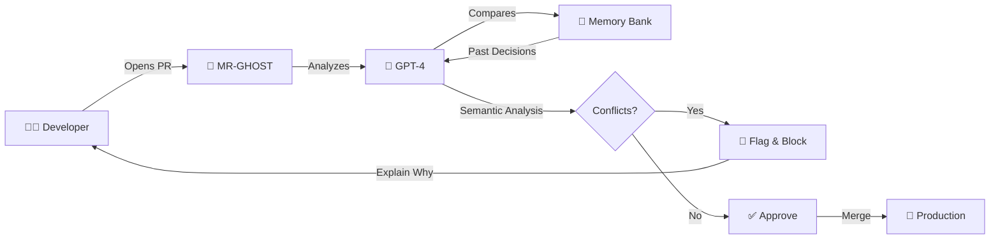
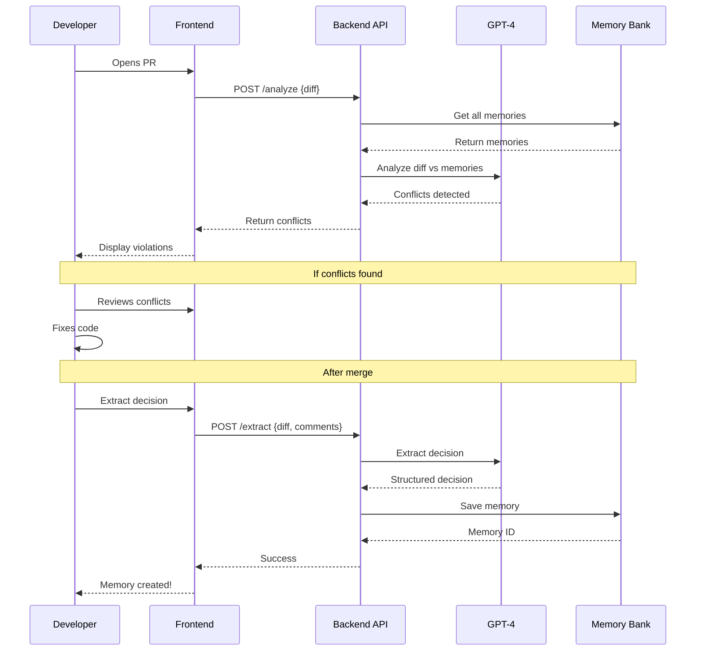

<div align="center">

# 🤖 MR-GHOST

### Memory Review - Guardian of Historical Organizational Software Traditions

**AI-Powered PR Review System with Institutional Memory**

[](https://www.python.org/)
[](https://fastapi.tiangolo.com/)
[](https://nextjs.org/)
[](https://openai.com/)
[](https://www.typescriptlang.org/)
[](LICENSE)

[Features](#-features) • [Demo](#-demo) • [Quick Start](#-quick-start) • [Architecture](#-architecture) • [Documentation](#-documentation)

---

</div>

## 🎯 The Problem

Software teams repeatedly make the same architectural mistakes because:

- 📚 **Lost Knowledge**: Critical decisions buried in old PRs and Slack threads
- 🔄 **Repeated Mistakes**: New developers don't know the "why" behind patterns
- ⚠️ **Syntax-Only Checks**: Traditional git conflicts only catch code syntax issues
- 💬 **Tribal Knowledge**: Institutional memory lives in people's heads, not systems
- 🚫 **No Semantic Analysis**: Can't detect when new code violates past architectural decisions

### Real-World Example

```python
# New PR introduces in-memory token caching
token_cache = {}

def get_auth_token(user_id: str) -> str:
    if user_id in token_cache:
        return token_cache[user_id]  # ❌ Violates MEM-001!
    ...
```

**The Issue**: 6 months ago, the team decided to NEVER cache auth tokens after a security incident. But this decision was lost in PR #42. New developer doesn't know and repeats the mistake.

**MR-GHOST Solution**: Automatically detects this semantic conflict and flags it before merge! 🚨

---

## ✨ The Solution

MR-GHOST acts as your team's **institutional memory guardian**, using GPT-4 to perform semantic code analysis:



---

## 🚀 Features

### 🧠 Semantic Conflict Detection
- **AI-Powered Analysis**: Uses GPT-4 to understand code semantics, not just syntax
- **Context-Aware**: Compares new code against historical architectural decisions
- **Intelligent Reasoning**: Explains WHY code violates past decisions

### 💾 Memory Bank
- **Persistent Storage**: Stores team decisions with full context
- **Rich Metadata**: Includes severity, author, reasoning, and PR references
- **Searchable**: Filter by module, severity, tags, or keywords
- **Versioned**: Track how decisions evolve over time

### 💬 Conversational AI (Ask Bob)
- **Natural Language**: Ask questions in plain English
- **Citation-Based**: Answers include references to specific memories
- **Context-Aware**: Understands your codebase's history
- **Interactive**: Suggested questions to get started

### 🎨 Beautiful UI
- **GitHub-Inspired**: Familiar interface for developers
- **Dark Theme**: Easy on the eyes during long code reviews
- **Smooth Animations**: Professional polish throughout
- **Toast Notifications**: Real-time feedback on all actions

### 🎭 Demo Mode
- **No API Key Required**: Works with mock data for presentations
- **Perfect for Hackathons**: Show off features without setup
- **Toggle On/Off**: Easy switch between demo and production

---

## 📸 Screenshots

### Main PR Review Interface
```
┌─────────────────────────────────────────────────────────────┐
│  🤖 IBM Bob Analysis                                        │
│  ━━━━━━━━━━━━━━━━━━━━━━━━━━━━━━━━━━━━━━━━━━━━━━━━━━━━━━ │
│                                                              │
│  🚨 MEM-001 Violation Detected                              │
│  This PR introduces in-memory caching for auth tokens.      │
│  This violates the decision to never cache auth responses.  │
│                                                              │
│  📋 Original Decision:                                      │
│  "Never cache auth token responses in any storage layer"   │
│                                                              │
│  👤 alice-sec  📅 Sep 14, 2025  🔴 Critical                │
│  [💬 Discuss] [⚠️ Override] [✅ Fix Issue]                 │
└─────────────────────────────────────────────────────────────┘
```

### Memory Bank Dashboard
```
┌──────────────┐  ┌──────────────┐  ┌──────────────┐
│  MEM-001     │  │  MEM-002     │  │  MEM-003     │
│  Auth        │  │  Auth        │  │  Database    │
│  🔴 Critical │  │  🟡 High     │  │  🔴 Critical │
│              │  │              │  │              │
│  Never cache │  │  Use server  │  │  Always use  │
│  auth tokens │  │  sessions    │  │  parameterized│
│              │  │  not JWTs    │  │  queries     │
└──────────────┘  └──────────────┘  └──────────────┘
```

### Ask Bob Chat Interface
```
┌─────────────────────────────────────────────────────────────┐
│  🤖 MR GHOST Agent                          🟢 Online       │
│  ━━━━━━━━━━━━━━━━━━━━━━━━━━━━━━━━━━━━━━━━━━━━━━━━━━━━━━ │
│                                                              │
│  👤 You: Why can't we cache auth tokens?                   │
│                                                              │
│  🤖 Bob: According to MEM-001, alice-sec decided to never  │
│         cache auth token responses after the Sept 2025      │
│         incident where revoked tokens were still served.    │
│                                                              │
│         📎 Citations: MEM-001                               │
│                                                              │
│  💡 Try asking:                                             │
│  • What's our policy on SQL queries?                       │
│  • Tell me about background jobs                           │
└─────────────────────────────────────────────────────────────┘
```

---

## 🏗️ Architecture

### System Overview

```mermaid
graph TB
    subgraph "Frontend (Next.js 16)"
        A[PR Review Page]
        B[Memory Bank]
        C[Ask Bob Chat]
    end
    
    subgraph "Backend (FastAPI)"
        D[API Gateway]
        E[Analysis Engine]
        F[Memory Manager]
    end
    
    subgraph "AI Layer"
        G[OpenAI GPT-4]
    end
    
    subgraph "Storage"
        H[Memory Bank JSON]
    end
    
    A -->|Analyze PR| D
    B -->|View/Extract| D
    C -->|Ask Question| D
    D --> E
    D --> F
    E -->|Semantic Analysis| G
    F -->|CRUD Operations| H
    G -->|AI Response| E
    
    style A fill:#1e1e2e
    style B fill:#1e1e2e
    style C fill:#1e1e2e
    style D fill:#2d2d3d
    style E fill:#2d2d3d
    style F fill:#2d2d3d
    style G fill:#5865f2
    style H fill:#3fb950
```



### Data Flow



### Tech Stack

| Layer | Technology | Purpose |
|-------|-----------|---------|
| **Frontend** | Next.js 16 | React framework with SSR |
| | TypeScript | Type safety |
| | Tailwind CSS | Utility-first styling |
| | Sonner | Toast notifications |
| | Lucide React | Icon library |
| **Backend** | FastAPI | Modern Python web framework |
| | Python 3.11+ | Core language |
| | Pydantic | Data validation |
| | Uvicorn | ASGI server |
| **AI** | OpenAI GPT-4 | Semantic code analysis |
| | LangChain (future) | Advanced AI workflows |
| **Storage** | JSON Files | Simple persistent storage |
| | PostgreSQL (future) | Production database |
| **DevOps** | Docker (future) | Containerization |
| | GitHub Actions (future) | CI/CD pipeline |

---

## 🚀 Quick Start

### Prerequisites

- **Python 3.11+** ([Download](https://www.python.org/downloads/))
- **Node.js 18+** ([Download](https://nodejs.org/))
- **OpenAI API Key** ([Get one](https://platform.openai.com/api-keys))

### Installation

#### 1️⃣ Clone the Repository

```bash
git clone https://github.com/yourusername/MR-GHOST.git
cd MR-GHOST
```

#### 2️⃣ Backend Setup

```bash
# Navigate to backend
cd backend

# Create virtual environment
python -m venv venv

# Activate virtual environment
# Windows:
venv\Scripts\activate
# Mac/Linux:
source venv/bin/activate

# Install dependencies
pip install -r requirements.txt

# Setup environment variables
cp .env.example .env
# Edit .env and add your OPENAI_API_KEY

# Run the server
uvicorn main:app --reload
```

✅ Backend running at **http://localhost:8000**

#### 3️⃣ Frontend Setup

Open a **new terminal**:

```bash
# Navigate to frontend
cd frontend

# Install dependencies
npm install

# Run development server
npm run dev
```

✅ Frontend running at **http://localhost:3000**

#### 4️⃣ Open Your Browser

Navigate to **http://localhost:3000** and start using MR-GHOST! 🎉

---

## 🎭 Demo Mode

Don't have an OpenAI API key? No problem!

```bash
# Edit backend/.env
DEMO_MODE=true
```

Restart the backend, and MR-GHOST will use mock data. Perfect for:
- 🎤 Presentations and demos
- 🧪 Testing without API costs
- 🏫 Educational purposes

---

## 📖 Usage Guide

### 1. Analyze a Pull Request

1. Open the main page
2. Click **"Run IBM Bob Analysis"**
3. Bob analyzes the PR diff against your memory bank
4. View any conflicts detected with full context

### 2. Extract Decisions from Merged PRs

1. Navigate to **Memory Bank** page
2. Click **"Extract from Merged PR"**
3. Fill in:
   - PR number (e.g., #210)
   - PR diff
   - PR comments/discussion
4. Click **"Extract Decision"**
5. Bob extracts and saves the architectural decision

### 3. Ask Questions

1. Use the **"Ask Bob"** chat interface
2. Type your question (e.g., "Why can't we use JWT tokens?")
3. Press **Enter** or click **Send**
4. Bob answers with citations to relevant memories

### 4. Browse Memory Bank

1. Go to **Memory Bank** page
2. Use search and filters to find decisions
3. Click on memory cards to view details
4. Filter by module, severity, or tags

---

## 🎯 API Documentation

### Endpoints

| Endpoint | Method | Description | Request Body |
|----------|--------|-------------|--------------|
| `/analyze` | POST | Analyze PR diff for conflicts | `{diff: string}` |
| `/extract` | POST | Extract decision from merged PR | `{diff: string, comments: string}` |
| `/ask` | POST | Ask Bob a question | `{question: string}` |
| `/memories` | GET | Get all memories | - |
| `/health` | GET | Health check | - |

### Example: Analyze PR

```bash
curl -X POST http://localhost:8000/analyze \
  -H "Content-Type: application/json" \
  -d '{
    "diff": "+ token_cache = {}\n+ def get_auth_token(user_id):\n+     return token_cache.get(user_id)"
  }'
```

**Response:**
```json
{
  "success": true,
  "conflicts": [
    {
      "memory_id": "MEM-001",
      "conflict_reasoning": "This PR introduces in-memory caching...",
      "severity": "critical",
      "who": "alice-sec",
      "when": "2025-09-14T09:23:00",
      "original_decision": "Never cache auth token responses..."
    }
  ]
}
```

---

## 📁 Project Structure

```
MR-GHOST/
├── backend/                    # FastAPI backend
│   ├── main.py                # API routes and server
│   ├── bob.py                 # AI logic (OpenAI integration)
│   ├── memory.py              # Memory bank operations
│   ├── team_decisions.json    # Memory storage
│   ├── requirements.txt       # Python dependencies
│   ├── .env.example          # Environment template
│   └── .env                  # Your config (gitignored)
│
├── frontend/                  # Next.js frontend
│   ├── src/
│   │   ├── app/
│   │   │   ├── page.tsx              # Main PR review page
│   │   │   ├── memory/page.tsx       # Memory bank page
│   │   │   ├── layout.tsx            # Root layout
│   │   │   └── globals.css           # Global styles
│   │   └── components/
│   │       ├── AskGhost.tsx          # Chat interface
│   │       ├── GhostComment.tsx      # Bob's review comment
│   │       ├── ConflictCard.tsx      # Conflict display
│   │       ├── MemoryCard.tsx        # Memory display
│   │       ├── ExtractMemoryModal.tsx # Extraction UI
│   │       └── PRDiff.tsx            # Diff viewer
│   ├── package.json
│   └── next.config.ts
│
├── README.md                  # This file
├── SETUP.md                   # Detailed setup guide
├── IMPROVEMENTS.md            # Changelog
└── start.bat                  # Quick start script (Windows)
```

---

## 🎨 Key Features Showcase

### 🧠 Semantic Analysis

Unlike traditional tools that only check syntax, MR-GHOST understands **meaning**:

```python
# These are semantically the same, but syntactically different:
token_cache = {}                    # Dictionary
token_cache = dict()                # Constructor
token_cache = Redis()               # Redis client

# MR-GHOST detects ALL of these violate the "no caching" decision!
```

### 💡 Intelligent Reasoning

Bob doesn't just say "no" - he explains **why**:

> "This PR introduces in-memory dictionary caching for authentication tokens. This violates the past decision to never cache auth token responses in any storage layer (including in-memory dicts or Redis). The decision was made after the Sept 2025 outage where revoked tokens were still being served from cache for 120 minutes after password reset."

### 🎯 Severity Levels

Decisions are categorized by impact:

- 🔴 **Critical**: Security issues, data loss risks
- 🟡 **High**: Performance problems, architectural violations
- 🟢 **Medium**: Code style, best practices

---

## 🔮 Future Enhancements

### Phase 1 (Next Sprint)
- [ ] GitHub webhook integration
- [ ] Automatic PR comments
- [ ] Slack/Discord notifications
- [ ] Multi-repository support

### Phase 2 (Q2 2026)
- [ ] PostgreSQL database
- [ ] User authentication
- [ ] Team collaboration features
- [ ] Memory versioning
- [ ] Advanced search with embeddings

### Phase 3 (Q3 2026)
- [ ] Analytics dashboard
- [ ] Decision impact tracking
- [ ] Code pattern detection
- [ ] Integration with Jira/Linear
- [ ] Custom AI models

---

## 🤝 Contributing

We welcome contributions! Here's how:

1. **Fork** the repository
2. **Create** a feature branch (`git checkout -b feature/amazing-feature`)
3. **Commit** your changes (`git commit -m 'Add amazing feature'`)
4. **Push** to the branch (`git push origin feature/amazing-feature`)
5. **Open** a Pull Request

### Development Setup

```bash
# Backend
cd backend
pip install -r requirements.txt
pytest  # Run tests

# Frontend
cd frontend
npm install
npm run lint
npm run build
```

---

## 📊 Performance

- **Analysis Time**: ~2-3 seconds per PR (with GPT-4)
- **Memory Lookup**: <100ms (JSON file)
- **Chat Response**: ~1-2 seconds
- **Concurrent Users**: 100+ (FastAPI async)

---

## 🔒 Security

- API keys stored in `.env` (never committed)
- CORS configured for localhost only
- Input validation with Pydantic
- Rate limiting (future)
- Audit logs (future)

---

## 📄 License

This project is licensed under the **MIT License** - see the [LICENSE](LICENSE) file for details.

---

## 🙏 Acknowledgments

- **OpenAI** for GPT-4 API
- **FastAPI** for the amazing Python framework
- **Next.js** team for the React framework
- **Vercel** for deployment platform
- **GitHub** for UI inspiration

---

## 📧 Contact & Support

- **Issues**: [GitHub Issues](https://github.com/yourusername/MR-GHOST/issues)
- **Discussions**: [GitHub Discussions](https://github.com/yourusername/MR-GHOST/discussions)
- **Email**: your.email@example.com
- **Twitter**: [@yourusername](https://twitter.com/yourusername)

---

## ⭐ Star History

If you find MR-GHOST useful, please consider giving it a star! ⭐

[](https://star-history.com/#yourusername/MR-GHOST&Date)

---

<div align="center">

**Made with ❤️ by developers who are tired of repeating mistakes**

[⬆ Back to Top](#-mr-ghost)

</div>